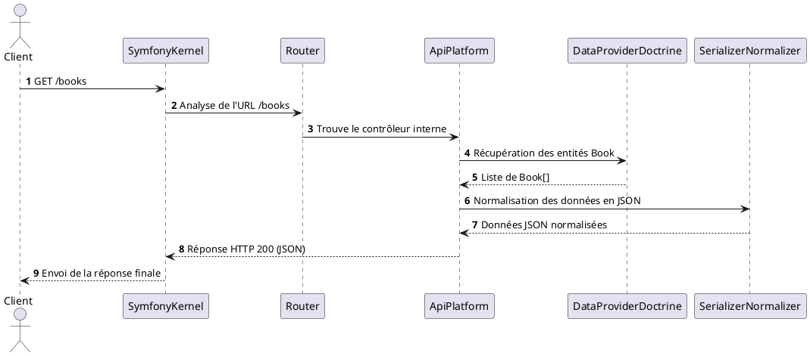

Ci-dessous, vous trouverez un tutoriel expliquant le fonctionnement d’API Platform au sein d’un projet Symfony, accompagné d’un schéma de séquence réalisé en PlantUML pour illustrer le flux de traitement d’une requête. L’objectif est de vous donner une vision claire du parcours d’une requête depuis le client jusqu’à la réponse JSON, en passant par les différentes couches de Symfony et API Platform.

## Prérequis et contexte

**Technologies :**  
- **Symfony** : Un framework PHP orienté MVC et basé sur un ensemble de composants réutilisables.  
- **API Platform** : Un framework surcouche de Symfony permettant de construire des API REST (et GraphQL) facilement, avec de nombreuses fonctionnalités intégrées comme la documentation OpenAPI (Swagger), la pagination, la validation, le tri et les filtres, etc.  
- **Doctrine ORM** : Gestionnaire d’entités et du mapping objet-relationnel, utilisé par défaut avec API Platform pour la persistance des données.

**Cas d’usage simple :**  
Imaginons un projet Symfony avec API Platform installé. Nous avons une entité `Book` représentant un livre, exposée comme une ressource d’API. L’API permet de récupérer la liste des livres (`GET /books`) et de récupérer un livre spécifique (`GET /books/{id}`).

## Comment fonctionne API Platform avec Symfony ?

1. **Configuration et annotation des ressources**  
   Dans un projet Symfony avec API Platform, vous créez un `src/Entity/Book.php` représentant une entité Doctrine. Pour rendre cette entité exposée en tant que ressource d’API, vous utilisez les annotations ou attributs API Platform :
   ```php
   use ApiPlatform\Metadata\ApiResource;
   use ApiPlatform\Metadata\Get;
   use ApiPlatform\Metadata\GetCollection;
   use Doctrine\ORM\Mapping as ORM;

   #[ORM\Entity]
   #[ApiResource(
       operations: [
           new Get(),
           new GetCollection()
       ]
   )]
   class Book
   {
       #[ORM\Id]
       #[ORM\GeneratedValue]
       #[ORM\Column(type: 'integer')]
       private int $id;

       #[ORM\Column(type: 'string')]
       private string $title;

       // Getters/Setters ...
   }
   ```
   Ces annotations (`#[ApiResource()]`, `#[Get()]`, `#[GetCollection()]`) indiquent à API Platform de générer automatiquement les endpoints REST (`/books` et `/books/{id}`).

2. **Routes et contrôleurs automatiques**  
   API Platform, lors du cache warmup (phase de compilation des métadonnées), analyse les entités annotées et génère les routes correspondantes. Ainsi, vous n’avez pas besoin de créer vos propres contrôleurs pour les opérations CRUD de base.  
   
   Derrière le rideau, API Platform crée des contrôleurs internes (génériques) capables de traiter les requêtes et de retourner les réponses adéquates. Ces contrôleurs utilisent le système d’événements et de normalisation de Symfony pour transformer les entités en JSON.

3. **Le cycle de requête/response**  
   Quand un client envoie une requête `GET /books`, Symfony reçoit la requête HTTP. Cette requête passe par la pile de middlewares, le routeur Symfony identifie la route correspondant à `/books`. Cette route pointe vers un contrôleur interne fourni par API Platform (non codé manuellement par vous, mais généré à la volée).

   Le contrôleur interne va :
   - Interroger la couche de persistance (Doctrine) pour récupérer les données (liste des livres).
   - Appliquer éventuellement les filtres, la pagination, etc.
   - Normaliser les données (entités Book) en JSON via le système de Serializer Symfony et le concept de Normalizer.
   - Retourner une réponse HTTP structurée (souvent au format JSON-LD, JSON, ou autre selon la configuration).

4. **Événements et extension du comportement**  
   API Platform s’appuie sur le système d’événements et de listeners (Event Subscribers, Data Providers, Data Persisters) pour que vous puissiez modifier ou enrichir le comportement par défaut. Vous pouvez par exemple :  
   - Ajouter un `DataProvider` personnalisé pour modifier la façon dont les données sont récupérées.  
   - Ajouter un `DataPersister` personnalisé pour gérer l’écriture des données autrement que par Doctrine.  
   - Utiliser des `Event Subscribers` pour ajouter des règles métier avant la transformation des données ou avant la persistence.

5. **Documentation automatique**  
   API Platform génère automatiquement une documentation OpenAPI / Swagger. L’URL `/docs` donne accès à une interface graphique (Swagger UI) permettant de tester les endpoints sans écrire de code supplémentaire.

## Schéma de séquence (PlantUML)

Le diagramme suivant illustre une requête `GET /books`. Ce diagramme montre les interactions entre le **Client**, le **Routeur Symfony**, le **Contrôleur interne API Platform**, le **Data Provider (Doctrine)**, et le **Normaliseur/Serializer** avant de retourner une réponse.



**Explications du diagramme :**  
- Le **Client** envoie une requête HTTP `GET /books`.  
- **Symfony Kernel** (le cœur du framework Symfony) reçoit la requête et la passe au **Router** qui détermine quelle ressource et quel contrôleur interne doit être appelé.  
- **ApiPlatform** fournit un contrôleur interne (pas de code spécifique à écrire pour ça) qui sait comment gérer la ressource Book.  
- Ce contrôleur interne utilise un **DataProvider** (basé sur Doctrine) pour obtenir la liste des entités Book depuis la base de données.  
- Une fois les données obtenues, le contrôleur interne passe la liste au **Serializer/Normalizer** pour convertir l’objet (entité) en un format JSON.  
- Le contrôleur interne d’API Platform retourne ensuite une réponse HTTP avec le contenu JSON au **Symfony Kernel**, qui la renvoie au **Client**.

## Conclusion

API Platform simplifie grandement la création d’APIs avec Symfony en gérant :  
- La génération des routes et des contrôleurs.  
- La sérialisation et la dé-sérialisation.  
- La documentation automatique.  
- Les opérations CRUD standard sans effort supplémentaire.

Le schéma de séquence permet de visualiser clairement les différentes étapes internes. Vous pouvez personnaliser chaque étape (données, normalisation, persistance) en injectant votre propre logique tout en bénéficiant de l’infrastructure offerte par API Platform.
