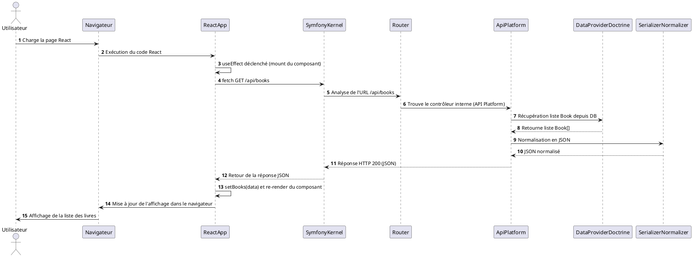

Ci-dessous, vous trouverez une présentation vulgarisée du fonctionnement d’une application **React** qui interagit avec un **back-end Symfony** exposant une API construite avec **API Platform**. Nous verrons également un schéma de séquence PlantUML illustrant le parcours d’une requête, cette fois-ci depuis le client React jusqu’au back-end.

## Contexte et Architecture

- **Front-end :** Une application écrite en React, une bibliothèque JavaScript très populaire pour construire des interfaces utilisateur réactives et dynamiques.  
- **Back-end :** Un serveur Symfony + API Platform qui expose des données via une API REST.  
- **Communication :** Le front-end React communique avec l’API du back-end via des requêtes HTTP (GET, POST, etc.) pour récupérer ou modifier des données.

## Parcours d’une requête côté front

1. **Composants React et état**  
   Dans React, vous avez des composants (par exemple un composant `BookList`), qui gèrent un état (`state`). Le composant `BookList` pourrait, par exemple, avoir un état `books` (un tableau) initialement vide.

2. **Appel à l’API depuis React**  
   Lors du montage du composant (via le hook `useEffect`, par exemple), vous faites une requête HTTP vers l’API exposée par Symfony/API Platform.  
   Par exemple, une requête `GET` vers `https://votre-domaine.com/api/books` afin de récupérer la liste des livres.  
   
   Pour cela, vous pouvez utiliser `fetch()` ou une librairie comme `axios` :
   ```javascript
   useEffect(() => {
     fetch('https://votre-domaine.com/api/books')
       .then(response => response.json())
       .then(data => setBooks(data));
   }, []);
   ```
   Cette requête part du navigateur vers le serveur Symfony/API Platform.

3. **API Platform côté back-end**  
   Lorsque `https://votre-domaine.com/api/books` est appelée, Symfony et API Platform :  
   - Identifient la ressource `Book` exposée (grâce à la configuration des `ApiResource` dans le code Symfony).  
   - Appellent le Data Provider (basé sur Doctrine) pour récupérer la liste des livres dans la base de données.  
   - Sérialisent les données dans un format JSON adapté.  
   - Renvoient une réponse HTTP 200 avec la liste des livres en JSON.

4. **Réception et affichage dans React**  
   Une fois la réponse reçue, votre code JavaScript dans React met à jour l’état `books` avec les données récupérées.  
   React re-render le composant `BookList` pour afficher la liste des livres.  
   
   Ainsi, l’utilisateur voit à l’écran les données récupérées dynamiquement depuis le back-end.

5. **Aller plus loin**  
   - Lorsque l’utilisateur ajoute ou modifie un livre, l’application React enverra des requêtes `POST`, `PUT` ou `DELETE` vers le même endpoint.  
   - API Platform gérera la validation, la mise à jour de la base de données, et renverra une réponse appropriée.  
   - Le front React actualisera l’interface en fonction de la réponse reçue.

## Schéma de séquence PlantUML

Le diagramme ci-dessous illustre la séquence d’actions lorsqu’un composant React requiert la liste des livres au back-end Symfony/API Platform :



**Explications du diagramme :**  
- L’**Utilisateur** charge la page, ce qui fait tourner l’application React dans le **Navigateur**.  
- L’application **React** s’initialise et exécute un `useEffect()` pour aller chercher les données.  
- Une requête `GET /api/books` est envoyée au **SymfonyKernel**, qui via le **Router**, dirige la requête vers **ApiPlatform**.  
- **ApiPlatform** utilise un **DataProviderDoctrine** pour récupérer les données depuis la base.  
- Une fois les données obtenues, elles sont normalisées (converties) en JSON par le **SerializerNormalizer**.  
- La réponse JSON est renvoyée au **SymfonyKernel**, puis jusqu’à l’appli **React**.  
- React met à jour son état (`setBooks`) et réaffiche le composant, provoquant la mise à jour visuelle dans le **Navigateur**, et donc l’affichage final à l’**Utilisateur**.

## Conclusion

- **React** gère l’interface utilisateur côté front-end, et interagit avec le back-end via des requêtes HTTP.  
- **Symfony/API Platform** gère la logique serveur, fournit les données (par exemple via Doctrine) et les expose au format JSON.  
- Cette architecture découple clairement le front (React) du back (Symfony + API Platform), permettant une évolution indépendante de chaque partie.
